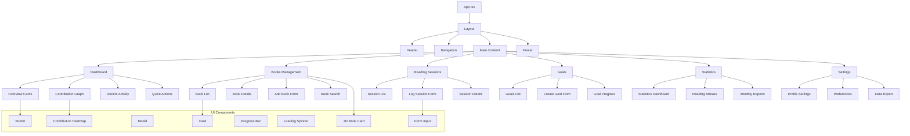
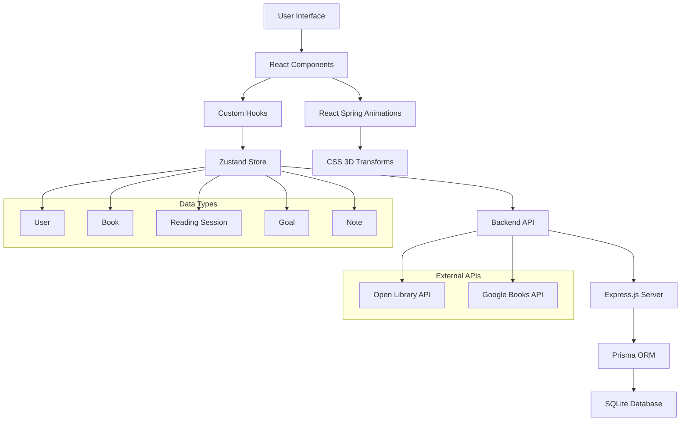
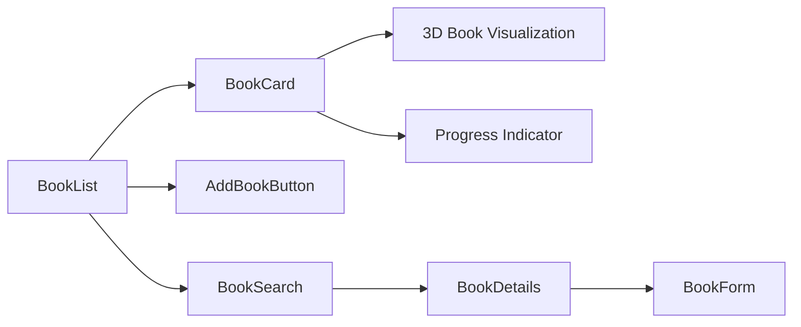
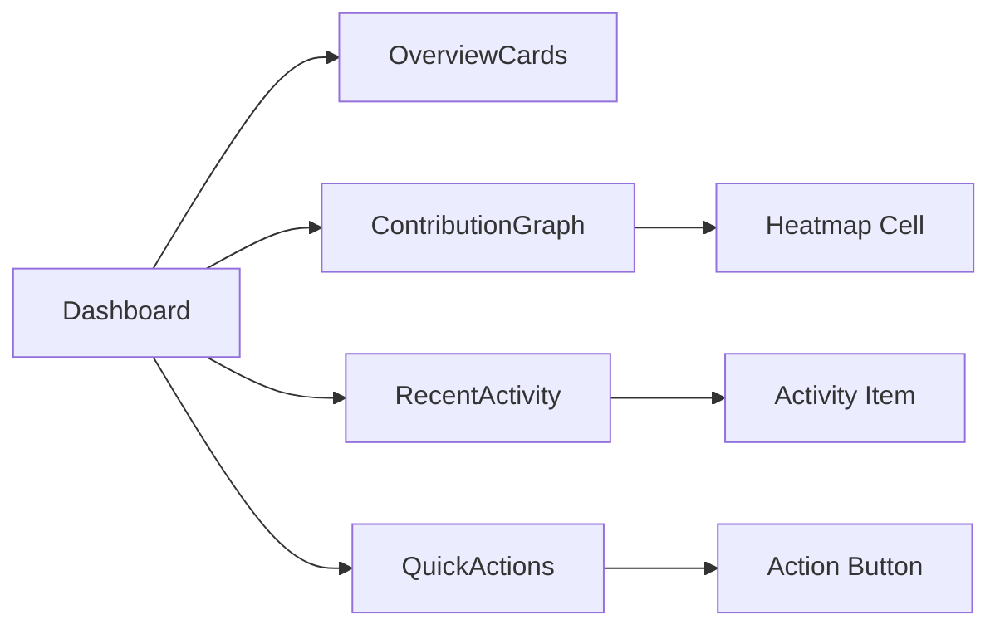

# Component Hierarchy & Data Flow Architecture

## Component Hierarchy Diagram



## Data Flow Diagram



## Component Relationship Details

### Layout Components
- **App.tsx**: Root component with routing and global state
- **Layout**: Main layout wrapper with header/footer
- **Navigation**: Sidebar/top navigation with route links

### Page Components
- **Dashboard**: Overview page with stats and quick actions
- **Books**: Book management with list, details, and forms
- **Reading Sessions**: Session logging and history
- **Goals**: Goal setting and progress tracking
- **Statistics**: Detailed analytics and reports
- **Settings**: User preferences and app configuration

### Feature-Specific Components

#### Books Module


#### Dashboard Module


### UI Component Library

#### Core UI Components
- **Button**: Primary/secondary variants with neon effects
- **Card**: Glass morphism cards with neon borders
- **Modal**: Overlay dialogs for forms and confirmations
- **Form Input**: Text inputs with validation and neon focus states
- **Progress Bar**: Animated progress indicators with 3D depth
- **Loading Spinner**: Animated loading states

#### Specialized Components
- **3D Book Card**: CSS-transformed book covers with hover effects
- **Contribution Heatmap**: GitHub-style activity grid
- **Streak Counter**: Animated number displays for streaks
- **Goal Progress Ring**: Circular progress indicators

## State Management Architecture

### Zustand Store Structure
```typescript
interface AppState {
  // User State
  user: User | null;
  
  // Books State
  books: Book[];
  currentBook: Book | null;
  searchResults: BookSearchResult[];
  
  // Reading Sessions State
  sessions: ReadingSession[];
  currentSession: ReadingSession | null;
  
  // Goals State
  goals: Goal[];
  activeGoals: Goal[];
  
  // UI State
  theme: 'dark' | 'light';
  isLoading: boolean;
  notifications: Notification[];
  
  // Actions
  actions: {
    // User actions
    login: (credentials: LoginCredentials) => Promise<void>;
    logout: () => Promise<void>;
    
    // Book actions
    addBook: (book: BookData) => Promise<void>;
    updateBook: (id: string, updates: Partial<Book>) => Promise<void>;
    deleteBook: (id: string) => Promise<void>;
    searchBooks: (query: string) => Promise<BookSearchResult[]>;
    
    // Session actions
    logSession: (session: SessionData) => Promise<void>;
    updateSession: (id: string, updates: Partial<ReadingSession>) => Promise<void>;
    
    // Goal actions
    createGoal: (goal: GoalData) => Promise<void>;
    updateGoalProgress: (id: string, progress: number) => Promise<void>;
    
    // UI actions
    setTheme: (theme: 'dark' | 'light') => void;
    addNotification: (notification: Notification) => void;
  };
}
```

## Component Communication Patterns

### Props Drilling Solution
- Use Zustand for global state management
- Context API for component-specific shared state
- Custom hooks for reusable component logic

### Event Handling
- Parent components pass handler functions as props
- Emit custom events for cross-component communication
- Zustand actions for complex state updates

### Error Boundaries
- Wrap critical components in Error Boundaries
- Provide graceful error fallbacks
- Log errors for debugging

## Performance Optimization

### Component Optimization
- React.memo for pure components
- useMemo for expensive calculations
- useCallback for stable function references
- Lazy loading for route-based code splitting

### State Optimization
- Normalize complex state structures
- Use selectors to prevent unnecessary re-renders
- Implement virtual scrolling for large lists

### 3D Effects Optimization
- CSS transforms over JavaScript animations
- Will-change CSS property for animated elements
- Reduce animation complexity on mobile devices
- Use transform3d for hardware acceleration